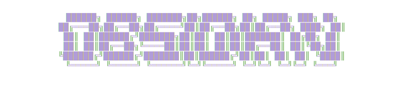
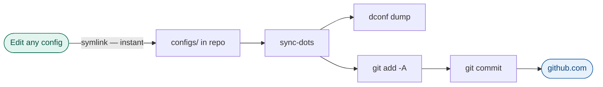

<div align="center">

<picture>
  
</picture>

**Dotfiles — Fedora Workstation**

_One script. Fresh Fedora 43+ install → fully configured development environment._

[](https://fedoraproject.org/)
[](configs/zsh/.zshrc)
[](scripts/)
[](handout.md)
[](LICENSE)

[🚀 Quick Start](#-quick-start) · [📁 Structure](#-structure) · [🔄 Daily Usage](#-daily-usage) · [📖 Setup Guide](docs/setup.md) · [📋 Handout](handout.md)

</div>

---

## 💡 How it works

Three ideas drive the whole design:

> [!NOTE]
> **Symlinks as the source of truth.** Every config file (`~/.zshrc`, `~/.config/nvim`, etc.) is a symlink pointing into this repo. Editing a config in your editor _is_ editing the repo — no copy step, no sync-back, no drift.

> [!NOTE]
> **Git as the sync mechanism.** `sync.sh` exports GNOME settings, stages everything with `git add -A`, and pushes. Because configs are symlinked, `git diff` always shows exactly what changed.

> [!NOTE]
> **Staged, resumable automation.** `setup.sh` runs through named stages and writes each completed stage to a local state file. Interrupted? Run `bash scripts/setup.sh --resume` and it picks up exactly where it left off.

---

## 📦 What's included

| Category                | Tools                                                                          |
| ----------------------- | ------------------------------------------------------------------------------ |
| 🐚 **Shell**            | zsh, Oh My Zsh, autosuggestions, syntax highlighting, history substring search |
| ✨ **Prompt**           | Starship with custom config                                                    |
| 🔤 **Font**             | JetBrainsMono Nerd Font (user-scoped, no root required)                        |
| 🖥️ **Terminal**         | WezTerm via COPR with terminfo                                                 |
| 📝 **Editors**          | Neovim (full config), micro (+ LSP plugin), nano                               |
| 🔧 **CLI tools**        | `eza` `bat` `fd` `zoxide` `thefuck` `btop` `yazi` `fastfetch` `bun`            |
| 🖱️ **GUI apps**         | VS Code, EasyEffects, GNOME Extension Manager, Flatseal, Smile                 |
| 🎨 **Desktop**          | Unite shell extension, GNOME settings restored via `dconf`                     |
| 📦 **Package managers** | dnf (primary), Homebrew, Flatpak / Flathub                                     |
| 🪟 **Windows apps**     | Docker-based WinApps (FreeRDP + winapps-org/winapps)                           |
| 🔀 **Sync**             | Git-only — symlinks make every config edit instantly committed                 |

---

## 📁 Structure

<details>
<summary>Expand full directory tree</summary>

```
obsidian/
├── configs/          ← dotfiles; source of truth; never copied during sync
│   ├── btop/
│   ├── gnome-extensions/
│   ├── micro/
│   ├── nano/
│   ├── nvim/         ← full Neovim config (symlinked as a directory)
│   ├── starship/
│   ├── wezterm/
│   ├── yazi/
│   └── zsh/
├── docs/
│   └── setup.md      ← step-by-step manual
├── extras/
│   └── rename/       ← playlist helper scripts
├── lib/              ← sourced modules; never run directly
│   ├── utils.sh      ← colours, logging, spinner, safe_symlink
│   ├── preflight.sh  ← OS, root, internet, git/SSH checks
│   ├── shell.sh      ← zsh, Oh My Zsh, plugins, font, Starship
│   ├── pkgmgr.sh     ← Homebrew + Flatpak/Flathub setup
│   ├── packages.sh   ← dnf / brew / flatpak installs
│   ├── editors.sh    ← prettier, micro LSP, Unite extension, dconf
│   ├── wezterm.sh    ← COPR, terminfo, config symlink
│   └── docker.sh     ← Docker CE + WinApps (optional)
├── scripts/          ← user-facing entry points
│   ├── setup.sh      ← orchestrator with stage resumption
│   ├── restore.sh    ← symlink manager (link / --check / --unlink)
│   └── sync.sh       ← git-only sync (dconf dump included)
├── state/            ← gitignored; setup progress file
├── zzz/              ← archive; do not modify
├── packages.conf     ← INI package list (dnf / homebrew / flatpak)
└── README.md
```

</details>

---

## ✅ Prerequisites

- [x] Fedora Workstation 43+
- [x] A regular user account _(not root — `setup.sh` will refuse to run as root)_
- [x] Internet connection
- [x] A GitHub account _(setup.sh will generate an SSH key if you don't have one)_

---

## 🚀 Quick Start

### Fresh machine

```bash
# 1. Clone the repo
git clone git@github.com:Mark-Muchiri/obsidian.git ~/repo/obsidian

# 2. Run setup
cd ~/repo/obsidian
bash scripts/setup.sh
```

> [!TIP]
> If setup asks you to restart your shell — close the terminal completely, open a new one, then run:
>
> ```bash
> bash scripts/setup.sh --resume
> ```
>
> The state machine remembers exactly where it left off.

### Restore configs on an existing machine

```bash
git clone git@github.com:Mark-Muchiri/obsidian.git ~/repo/obsidian
bash ~/repo/obsidian/scripts/restore.sh
```

---

## 🔄 Daily Usage

### Sync changes to GitHub

```bash
bash scripts/sync.sh   # or the alias: sync-dots
```

Here's what happens under the hood:



### Verify all symlinks are intact

```bash
bash scripts/restore.sh --check
```

### Add a new config file

1. Move the file into the appropriate `configs/` subdirectory
2. Add one line to `CONFIG_MAP` in `scripts/restore.sh`
3. Run `bash scripts/restore.sh` to create the symlink
4. Run `bash scripts/sync.sh` to commit

> [!TIP]
> See [docs/setup.md](docs/setup.md) for the full walkthrough.

---

## ⚙️ Setup flags

| Command                            | Effect                                    |
| ---------------------------------- | ----------------------------------------- |
| `bash scripts/setup.sh`            | Fresh install — runs all stages in order  |
| `bash scripts/setup.sh --resume`   | Skip completed stages, continue from last |
| `bash scripts/setup.sh --reset`    | Clear state and re-run all stages[^1]     |
| `bash scripts/restore.sh`          | Create all config symlinks                |
| `bash scripts/restore.sh --check`  | Verify all symlinks — no changes made     |
| `bash scripts/restore.sh --unlink` | Remove symlinks, restore any backups      |
| `bash scripts/sync.sh`             | Dump dconf + commit + push                |

[^1]: `--reset` clears the stage progress file only. It does **not** uninstall any packages or undo any system changes.

---

## 🔀 How sync works

All configs in `configs/` are **symlinked** — not copied — into their system locations. Editing `~/.zshrc` edits `configs/zsh/.zshrc` directly. `sync.sh` runs `git add -A`, so every config change is captured automatically with no manual copy step.

```
~/.zshrc                    →  configs/zsh/.zshrc
~/.config/nvim              →  configs/nvim/
~/.config/wezterm/wezterm.lua  →  configs/wezterm/wezterm.lua
          ︙                              ︙
     live system                    git repo  →  GitHub
```

---

## 🔍 ShellCheck

All scripts and lib modules are ShellCheck-clean. Run before every commit:

```bash
for f in lib/*.sh scripts/*.sh; do shellcheck -x -s bash "$f" && echo "✔ $f"; done
```

> [!CAUTION]
> Always pass `-x` — without it, ShellCheck cannot follow `source` directives and will report false positives on every script that sources a `lib/` module.

---

## 👥 For contributors and maintainers

> [!IMPORTANT]
> Read [`handout.md`](handout.md) **before making any changes.**

`handout.md` is a complete technical reference covering:

- Every design decision and the rationale behind it
- Full source of every script
- Every bug found and fixed during development
- Current known gaps (including what's untested)
- A visual stage-flow diagram of `setup.sh`

It is written so that a technical reader — or an AI assistant — can continue the project with full context and zero prior knowledge of its history.

---

<div align="center">

_Built for one machine. Published in case the approach is useful to others._

</div>
