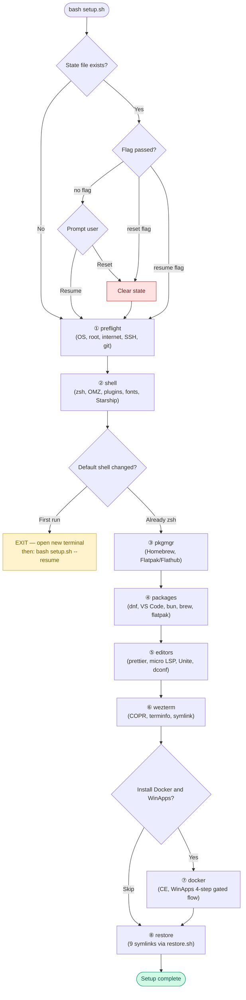

<div align="center">


# Obsidian Dotfiles — Project Handout

_Complete context for a new developer or AI agent to continue this project without loss of understanding._

</div>

---

## Quick Navigation

| #   | Section                                              | What's inside                                        |
| --- | ---------------------------------------------------- | ---------------------------------------------------- |
| 1   | [Project Purpose](#1-project-purpose)                | What the repo does, clone path, primary machine      |
| 2   | [Project Status](#2-project-status--complete)        | Completion checklist + last git state                |
| 3   | [File & Folder Structure](#3-file--folder-structure) | Annotated directory tree                             |
| 4   | [Key Design Decisions](#4-key-design-decisions)      | Every major architectural choice with rationale      |
| 5   | [Working Conventions](#5-working-conventions)        | Shell rules, output format, ShellCheck, git workflow |
| 6   | [Complete File Contents](#6-complete-file-contents)  | Full source of every script and config (collapsible) |
| 7   | [Tested Behaviours](#7-tested-behaviours)            | What was verified on Fedora 44                       |
| 8   | [Known Gap](#8-known-gap)                            | VS Code first-run path untested                      |
| 9   | [If Something Breaks](#9-if-something-breaks)        | Break-glass commands                                 |

---

## 1. Project Purpose

This repo automates the complete setup, configuration restore, and Git-based sync of a **Fedora Workstation 43+** development environment — covering shell, fonts, CLI tools, GUI apps, editors, terminal emulator, and Windows app integration via WinApps — so any machine can be brought to a fully configured state by running a single script.

|                             |                                            |
| --------------------------- | ------------------------------------------ |
| **Repo**                    | `git@github.com:Mark-Muchiri/obsidian.git` |
| **Clone path (convention)** | `~/repo/obsidian`                          |
| **Primary machine**         | Fedora 44, username `obsidian`             |

---

## 2. Project Status — COMPLETE

> [!NOTE]
> All scripts written, ShellCheck-clean, and tested live on Fedora 44.

### Checklist

- [x] Restructure repo into `configs/`, `lib/`, `scripts/`, `docs/`, `extras/`, `zzz/`
- [x] `lib/utils.sh` — shared utilities foundation
- [x] `lib/preflight.sh` — OS/root/internet/GitHub checks
- [x] `lib/shell.sh` — zsh, Oh My Zsh, plugins, JetBrainsMono Nerd Font, Starship
- [x] `lib/pkgmgr.sh` — Homebrew + Flatpak/Flathub setup
- [x] `lib/packages.sh` — INI parser + dnf/brew/flatpak install functions + VS Code + bun
- [x] `lib/editors.sh` — prettier, micro LSP, Unite GNOME extension, dconf restore
- [x] `lib/wezterm.sh` — COPR, terminfo, config symlink
- [x] `lib/docker.sh` — Docker CE + WinApps (4-step gated manual flow)
- [x] `scripts/setup.sh` — orchestrator with state machine and resume logic
- [x] `scripts/restore.sh` — symlink manager (link / --check / --unlink), fully tested
- [x] `scripts/sync.sh` — dconf dump + git add/commit/push + graph log
- [x] `packages.conf` — INI-format package list
- [x] `README.md` — GitHub landing page
- [x] `docs/setup.md` — step-by-step manual
- [x] `.gitignore` — state/, \*.swp, .DS_Store, \*.bak.\*, secrets
- [x] `sync-dots` / `restore-dots` aliases in `.zshrc`
- [x] Full end-to-end test on Fedora 44 live machine

<details>
<summary>📌 Last known git state</summary>

```
commit (HEAD -> main, origin/main)
All scripts and lib modules complete. restore.sh fully tested.
```

</details>

---

## 3. File & Folder Structure

<details>
<summary>📂 Expand directory tree</summary>

```
obsidian/
├── configs/                  ← dotfiles; source of truth; never copied during sync
│   ├── btop/
│   │   └── btop.conf
│   ├── gnome-extensions/
│   │   └── gnome-extensions.txt   ← exported by sync.sh via dconf dump
│   ├── micro/
│   │   ├── micro/
│   │   │   └── bindings.json
│   │   └── settings.json
│   ├── nano/
│   │   └── nanorc
│   ├── nvim/                 ← full Neovim config (symlinked as a directory)
│   │   ├── .luarc.json
│   │   ├── .neoconf.json
│   │   ├── .stylua.toml
│   │   ├── init.lua
│   │   ├── lazy-lock.json
│   │   ├── me.lua
│   │   ├── neovim.yml
│   │   ├── README.md
│   │   ├── selene.toml
│   │   └── lua/
│   │       ├── community.lua
│   │       ├── lazy_setup.lua
│   │       ├── polish.lua
│   │       └── plugins/
│   ├── starship/
│   │   └── starship.toml
│   ├── wezterm/
│   │   └── wezterm.lua
│   ├── yazi/
│   │   └── yazi.toml
│   └── zsh/
│       └── .zshrc
├── docs/
│   └── setup.md
├── extras/
│   └── rename/               ← playlist helper scripts
├── lib/                      ← sourced modules; never run directly
│   ├── utils.sh
│   ├── preflight.sh
│   ├── shell.sh
│   ├── pkgmgr.sh
│   ├── packages.sh
│   ├── editors.sh
│   ├── wezterm.sh
│   └── docker.sh
├── scripts/                  ← user-facing entry points
│   ├── setup.sh
│   ├── restore.sh
│   └── sync.sh
├── state/                    ← gitignored; contains .setup_state progress file
├── zzz/                      ← archive; do not modify
├── .gitignore
├── packages.conf
├── README.md
└── handout.md                ← this file
```

</details>

---

## 4. Key Design Decisions

<details>
<summary>📋 Expand all design decisions (26 entries)</summary>

| Decision                                        | Rationale                                                                                                                                   |
| ----------------------------------------------- | ------------------------------------------------------------------------------------------------------------------------------------------- |
| **Symlinks, not copies**                        | Edits to live configs are instantly in the repo. `sync.sh` captures everything with `git add -A`.                                           |
| **Sync = git commands only**                    | The repo is the source of truth. `sync.sh` is dconf dump + three git commands.                                                              |
| **dconf dump in sync.sh**                       | GNOME extension settings live in a binary database, not a file. Must be explicitly exported before `git add`.                               |
| **Package priority: dnf → homebrew → flatpak**  | dnf is native. Homebrew and Flatpak only used when a package is unavailable in dnf.                                                         |
| **VS Code filtered from dnf batch**             | Requires Microsoft GPG key + yum repo added first. Handled by `_install_vscode()` separately.                                               |
| **bun not in packages.conf**                    | Not in Fedora repos. Installed via official `curl \| bash` installer in `_install_bun()`.                                                   |
| **Shell stage runs first**                      | Everything else depends on zsh and Oh My Zsh being in place.                                                                                |
| **Mandatory shell restart gate**                | After `setup_shell` changes the default shell, script writes a sentinel and exits. Re-run with `--resume` continues past the gate.          |
| **Stage state machine in `state/.setup_state`** | Allows `--resume` after the shell restart. Each stage name written to file on completion. Gitignored.                                       |
| **`safe_symlink` in utils.sh**                  | Centralised symlink logic: skip if correct, backup with timestamp if dest exists, create parent dirs.                                       |
| **`restore.sh` sourced by `setup.sh`**          | `do_link` must be callable as a function. A `BASH_SOURCE` guard prevents `main()` firing on source.                                         |
| **`rpm -q --whatprovides`**                     | On Fedora 44 packages like `wget2-wget` provide `wget` but aren't named `wget`. `--whatprovides` resolves virtual provides correctly.       |
| **`unzip -q -o`**                               | `-o` overwrites silently on re-runs — prevents interactive prompt when font files already exist.                                            |
| **Font file-existence check before download**   | `_install_jetbrains_font` checks `fc-list`, then checks for `.ttf` files on disk, then downloads. Prevents re-downloading on `--reset`.     |
| **Docker container-exists check**               | `docker compose ps --all` detects existing (stopped) Windows containers — skips the first-time review prompt and just starts the container. |
| **WinApps cloned to `~/.config/winapps`**       | This is where `compose.yaml`, `winapps.conf`, and the WinApps source all live per the upstream docs.                                        |
| **VM stop after WinApps install**               | `docker compose stop` runs at end of `setup_docker`. WinApps starts Windows on demand — no reason to leave it running.                      |
| **`configs/nvim` symlinked as a directory**     | Neovim writes files inside `~/.config/nvim/`. Symlinking the whole directory means all writes go directly into the repo.                    |
| **GUI-managed configs excluded from symlinks**  | GNOME settings are managed via dconf — handled separately in `lib/editors.sh` and `sync.sh`.                                                |
| **No root execution**                           | Script dies early if `EUID == 0`. `sudo` used only where necessary, always with a comment.                                                  |
| **Idempotency everywhere**                      | Every step checks if already done and skips. Safe to re-run on a partially configured system.                                               |
| **`$'...'` for escape sequences**               | Colour codes use `$'\033[...'` — single-quoted form prints literally.                                                                       |
| **`printf` colour rule**                        | Colour variables never in the format string — always passed as `%s` arguments (SC2059).                                                     |
| **Secrets never committed**                     | SSH private keys, `.pem` files excluded via `.gitignore`.                                                                                   |

</details>

---

## 5. Working Conventions

<details>
<summary>🐚 Shell rules</summary>

- All scripts: `#!/usr/bin/env bash` + `set -euo pipefail`
- Sourced modules: guard with `[[ -n "${_MODULE_LOADED:-}" ]] && return 0`
- Variables: `local` inside functions, `lowercase_with_underscores`
- No `echo -e` — always `printf`
- No hardcoded paths — `REPO_DIR` resolved at script start via `cd "$(dirname ...)" && pwd`
- All paths use `${HOME}` and `${USER}` — fully portable across usernames and clone locations

</details>

<details>
<summary>🎨 Output conventions</summary>

```bash
ok "success message"       # green  ✔
warn "advisory message"    # yellow ⚠  (non-fatal, goes to stderr)
die "fatal message"        # red    ✖  (exits 1, goes to stderr)
info "informational"       # cyan   →
progress "in-progress"     # dim    …
progress_header "Stage"    # cyan banner box
```

**Printf colour rule**

```bash
# WRONG:
printf "${C_GREEN}message${C_RESET}\n"
# CORRECT:
printf '%smessage%s\n' "${C_GREEN}" "${C_RESET}"
```

</details>

<details>
<summary>🔍 ShellCheck</summary>

```bash
shellcheck -x -s bash <file>
# -x required for scripts/ that source lib/ modules
# Zero warnings or errors — no suppressions without documented reason
```

One documented suppression exists in `lib/pkgmgr.sh`:

```bash
# SC2016: single quotes intentional — $() must print literally as a copyable snippet
# shellcheck disable=SC2016
printf '    eval "$(/home/linuxbrew/.linuxbrew/bin/brew shellenv)"\n'
```

</details>

<details>
<summary>🔀 Git workflow</summary>

```bash
bash scripts/sync.sh                      # sync-dots alias
bash scripts/restore.sh                   # restore-dots alias
bash scripts/restore.sh --check
bash scripts/restore.sh --unlink
bash scripts/setup.sh
bash scripts/setup.sh --resume
bash scripts/setup.sh --reset
```

</details>

---

## Setup Stage Flow

> [!TIP]
> `setup.sh` is a state machine — each stage writes its name to `state/.setup_state` on completion. `--resume` skips already-completed stages; `--reset` clears the file so all stages re-run.



---

## 6. Complete File Contents

> [!NOTE]
> Each file is collapsed by default. Click a summary to expand.

<details>
<summary><code>lib/utils.sh</code> — shared utilities (colours, logging, spinner, symlinks, banners)</summary>

```bash
#!/usr/bin/env bash
# lib/utils.sh — Shared utilities for Obsidian dotfiles scripts
# Sourced by all scripts. Never run directly.

[[ -n "${_UTILS_LOADED:-}" ]] && return 0
_UTILS_LOADED=1

if [[ -t 1 ]]; then
  C_RESET=$'\033[0m'
  C_BOLD=$'\033[1m'
  C_GREEN=$'\033[0;32m'
  C_YELLOW=$'\033[0;33m'
  C_RED=$'\033[0;31m'
  C_CYAN=$'\033[0;36m'
  C_DIM=$'\033[2m'
else
  C_RESET='' C_BOLD='' C_GREEN='' C_YELLOW='' C_RED='' C_CYAN='' C_DIM=''
fi

ok()              { printf '%s%s  ✔  %s%s\n' "${C_GREEN}" "${C_BOLD}" "$*" "${C_RESET}"; }
warn()            { printf '%s%s  ⚠  %s%s\n' "${C_YELLOW}" "${C_BOLD}" "$*" "${C_RESET}" >&2; }
die()             { printf '%s%s  ✖  ERROR: %s%s\n' "${C_RED}" "${C_BOLD}" "$*" "${C_RESET}" >&2; exit 1; }
info()            { printf '%s  →  %s%s\n' "${C_CYAN}" "$*" "${C_RESET}"; }
progress()        { printf '%s  …  %s%s\n' "${C_DIM}" "$*" "${C_RESET}"; }

progress_header() {
  local name="$1"
  printf '\n'
  printf '%s══════════════════════════════════════════%s\n' "${C_BOLD}${C_CYAN}" "${C_RESET}"
  printf '%s  ▶  Stage: %s%s\n'                            "${C_BOLD}${C_CYAN}" "${name}" "${C_RESET}"
  printf '%s══════════════════════════════════════════%s\n' "${C_BOLD}${C_CYAN}" "${C_RESET}"
}

_SPINNER_PID=''
spinner_start() {
  local msg="${1:-Working…}"
  local frames=('⠋' '⠙' '⠹' '⠸' '⠼' '⠴' '⠦' '⠧' '⠇' '⠏')
  ( local i=0
    while true; do
      printf "\r%s  %s  %s%s" "${C_CYAN}" "${frames[i]}" "${msg}" "${C_RESET}" >&2
      i=$(( (i + 1) % ${#frames[@]} ))
      sleep 0.1
    done ) &
  _SPINNER_PID=$!
  trap 'spinner_stop' EXIT
}
spinner_stop() {
  if [[ -n "${_SPINNER_PID}" ]]; then
    kill "${_SPINNER_PID}" 2>/dev/null
    wait "${_SPINNER_PID}" 2>/dev/null
    _SPINNER_PID=''
    printf '\r\033[K' >&2
  fi
}

check_battery() {
  local battery_path
  battery_path="$(find /sys/class/power_supply -name 'capacity' -path '*/BAT*' 2>/dev/null | head -1)"
  [[ -z "${battery_path}" ]] && return 0
  local capacity status_path status
  capacity="$(cat "${battery_path}")"
  status_path="${battery_path%capacity}status"
  status="$(cat "${status_path}" 2>/dev/null || printf 'Unknown')"
  if [[ "${status}" == "Discharging" && "${capacity}" -lt 50 ]]; then
    warn "Battery at ${capacity}% and discharging. Consider plugging in."
    prompt_yes_no "Continue anyway?" || die "Aborted by user."
  fi
}

prompt_yes_no() {
  local msg="$1" reply
  while true; do
    printf '%s  ?  %s [Y/n]: %s' "${C_BOLD}" "${msg}" "${C_RESET}"
    read -r reply; reply="${reply:-Y}"
    case "${reply}" in
      [Yy]*) return 0 ;;
      [Nn]*) return 1 ;;
      *)     warn "Please answer y or n." ;;
    esac
  done
}

safe_symlink() {
  local src="$1" dest="$2"
  [[ ! -e "${src}" ]] && die "safe_symlink: source does not exist: ${src}"
  if [[ -L "${dest}" && "$(readlink "${dest}")" == "${src}" ]]; then
    warn "  Already linked: ${dest} → ${src}"; return 0
  fi
  mkdir -p "$(dirname "${dest}")"
  if [[ -e "${dest}" || -L "${dest}" ]]; then
    local backup="${dest}.bak.$(date +%Y%m%dT%H%M%S)"
    info "  Backing up existing ${dest} → ${backup}"
    mv "${dest}" "${backup}"
  fi
  ln -s "${src}" "${dest}"
  ok "  Linked: ${dest} → ${src}"
}

print_banner() {
  printf '%s' "${C_BOLD}${C_CYAN}"
  printf '   ██████╗ ██████╗ ███████╗██╗██████╗ ██╗ █████╗  ███╗   ██╗\n'
  printf '  ██╔═══██╗██╔══██╗██╔════╝██║██╔══██╗██║██╔══██╗ ████╗  ██║\n'
  printf '  ██║   ██║██████╔╝███████╗██║██║  ██║██║███████║ ██╔██╗ ██║\n'
  printf '  ██║   ██║██╔══██╗╚════██║██║██║  ██║██║██╔══██║ ██║╚██╗██║\n'
  printf '  ╚██████╔╝██████╔╝███████║██║██████╔╝██║██║  ██║ ██║ ╚████║\n'
  printf '   ╚═════╝ ╚═════╝ ╚══════╝╚═╝╚═════╝ ╚═╝╚═╝  ╚═╝╚═╝  ╚═══╝\n'
  printf '            Dotfiles — Fedora Workstation                     \n'
  printf '%s' "${C_RESET}"
  printf '%s  Repository : %s%s\n' "${C_DIM}" "${REPO_DIR}" "${C_RESET}"
  printf '%s  User       : %s%s\n' "${C_DIM}" "${USER}"     "${C_RESET}"
  printf '%s  Date       : %s%s\n' "${C_DIM}" "$(date '+%Y-%m-%d %H:%M')" "${C_RESET}"
  printf '\n'
}

print_success_summary() {
  printf '\n'
  printf '%s╔══════════════════════════════════════════╗%s\n' "${C_GREEN}${C_BOLD}" "${C_RESET}"
  printf "%s║       Setup complete! What's next:       ║%s\n" "${C_GREEN}${C_BOLD}" "${C_RESET}"
  printf '%s╚══════════════════════════════════════════╝%s\n' "${C_GREEN}${C_BOLD}" "${C_RESET}"
  printf '\n'
  printf '  %sSync changes to GitHub:%s\n'                 "${C_BOLD}" "${C_RESET}"
  printf '    bash %s/scripts/sync.sh\n\n'                 "${REPO_DIR}"
  printf '  %sRestore configs on another machine:%s\n'     "${C_BOLD}" "${C_RESET}"
  printf '    bash %s/scripts/restore.sh\n\n'              "${REPO_DIR}"
  printf '  %sRe-run setup (resumes from last stage):%s\n' "${C_BOLD}" "${C_RESET}"
  printf '    bash %s/scripts/setup.sh --resume\n\n'       "${REPO_DIR}"
}
```

</details>

<details>
<summary><code>lib/preflight.sh</code> — OS / root / internet / SSH / git checks</summary>

```bash
#!/usr/bin/env bash
# lib/preflight.sh — Pre-flight checks
# Sourced by scripts/setup.sh — do not run directly.

[[ -n "${_PREFLIGHT_LOADED:-}" ]] && return 0
_PREFLIGHT_LOADED=1

_check_fedora_version() {
  local os_id version_id
  os_id="$(     grep '^ID='         /etc/os-release | cut -d= -f2 | tr -d '"' )"
  version_id="$( grep '^VERSION_ID=' /etc/os-release | cut -d= -f2 | tr -d '"' )"
  [[ "${os_id}" != "fedora" ]] && die "This script targets Fedora only. Detected: '${os_id}'."
  if [[ ! "${version_id}" =~ ^[0-9]+$ ]] || (( version_id < 43 )); then
    die "Fedora 43+ required. Detected: ${version_id}."
  fi
  ok "OS check passed — Fedora ${version_id}."
}

_check_not_root() {
  (( EUID == 0 )) && die "Do not run as root. Use your normal user — sudo is used internally."
  ok "User check passed — running as '${USER}' (uid ${EUID})."
}

_check_internet() {
  info "Checking internet connectivity…"
  ping -c 2 -W 3 1.1.1.1 &>/dev/null || die "No internet connection detected."
  ok "Internet connectivity confirmed."
}

_ensure_git_installed() {
  if ! command -v git &>/dev/null; then
    info "git not found — installing via dnf5…"
    sudo dnf5 install -y git || die "Failed to install git."
    ok "git installed."
  else
    ok "git already installed ($(git --version))."
  fi
}

_configure_git_identity() {
  local git_user git_email
  git_user="$(git config --global user.name  2>/dev/null || true)"
  git_email="$(git config --global user.email 2>/dev/null || true)"
  if [[ -z "${git_user}" ]]; then
    printf '%s  ?  GitHub username (for git config): %s' "${C_BOLD}" "${C_RESET}"
    read -r git_user
    [[ -z "${git_user}" ]] && die "Git username cannot be empty."
    git config --global user.name "${git_user}"
  else
    info "Git user already set: ${git_user}"
  fi
  if [[ -z "${git_email}" ]]; then
    printf '%s  ?  GitHub email (for git config): %s' "${C_BOLD}" "${C_RESET}"
    read -r git_email
    [[ -z "${git_email}" ]] && die "Git email cannot be empty."
    git config --global user.email "${git_email}"
  else
    info "Git email already set: ${git_email}"
  fi
  ok "Git identity: ${git_user} <${git_email}>."
}

_ensure_ssh_key() {
  local key_path="${HOME}/.ssh/id_ed25519" pub_path="${HOME}/.ssh/id_ed25519.pub"
  if [[ -f "${key_path}" && -f "${pub_path}" ]]; then
    ok "SSH key already exists at ${key_path}."; return 0
  fi
  info "No SSH key found — generating…"
  local git_email
  git_email="$(git config --global user.email 2>/dev/null || true)"
  [[ -z "${git_email}" ]] && die "Git email not set — run _configure_git_identity first."
  ssh-keygen -t ed25519 -C "${git_email}" -f "${key_path}" -N "" || die "ssh-keygen failed."
  ok "SSH key generated."
  printf '\n'
  printf '%s  Add the following public key to GitHub → Settings → SSH keys%s\n' "${C_BOLD}${C_YELLOW}" "${C_RESET}"
  printf '\n'; cat "${pub_path}"; printf '\n'
  prompt_yes_no "Have you added the key to GitHub?" || die "Add your SSH key, then re-run."
}

_test_github_ssh() {
  info "Testing SSH connection to GitHub…"
  local ssh_output
  ssh_output="$(ssh -T -o StrictHostKeyChecking=accept-new -o ConnectTimeout=10 git@github.com 2>&1 || true)"
  printf '%s' "${ssh_output}" | grep -q "successfully authenticated" \
    || die "GitHub SSH test failed. Output: ${ssh_output}"
  ok "GitHub SSH authentication successful."
}

preflight_checks() {
  _check_fedora_version
  _check_not_root
  _check_internet
  if prompt_yes_no "Set up GitHub backup (SSH)?"; then
    _ensure_git_installed
    _configure_git_identity
    _ensure_ssh_key
    _test_github_ssh
  else
    _ensure_git_installed
    _configure_git_identity
    warn "GitHub backup skipped. Re-run setup.sh to add it later."
  fi
  ok "Pre-flight complete — all checks passed."
}
```

</details>

<details>
<summary><code>lib/shell.sh</code> — zsh, Oh My Zsh, plugins, JetBrainsMono, Starship</summary>

```bash
#!/usr/bin/env bash
# lib/shell.sh — Shell & terminal setup stage
# Sourced by scripts/setup.sh — do not run directly.

[[ -n "${_SHELL_LOADED:-}" ]] && return 0
_SHELL_LOADED=1

_install_zsh() {
  command -v zsh &>/dev/null && { ok "zsh already installed ($(zsh --version | head -1))."; return 0; }
  progress "Installing zsh via dnf5…"
  sudo dnf5 install -y zsh || die "Failed to install zsh."
  ok "zsh installed."
}

_set_default_shell() {
  local zsh_path
  zsh_path="$(command -v zsh)" || die "zsh not found in PATH."
  [[ "${SHELL}" == "${zsh_path}" ]] && { ok "Default shell is already zsh."; return 0; }
  grep -qx "${zsh_path}" /etc/shells || printf '%s\n' "${zsh_path}" | sudo tee -a /etc/shells >/dev/null
  chsh -s "${zsh_path}" || die "chsh failed."
  ok "Default shell set to zsh."
}

_install_oh_my_zsh() {
  [[ -d "${HOME}/.oh-my-zsh" ]] && { ok "Oh My Zsh already installed."; return 0; }
  progress "Installing Oh My Zsh…"; check_battery
  RUNZSH=no CHSH=no sh -c "$(curl -fsSL https://raw.githubusercontent.com/ohmyzsh/ohmyzsh/master/tools/install.sh)" \
    || die "Oh My Zsh installation failed."
  ok "Oh My Zsh installed."
}

_install_zsh_plugin() {
  local name="$1" repo="$2"
  local plugin_dir="${ZSH_CUSTOM:-${HOME}/.oh-my-zsh/custom}/plugins/${name}"
  [[ -d "${plugin_dir}" ]] && { warn "  Plugin '${name}' already installed — skipping."; return 0; }
  progress "  Installing plugin: ${name}…"
  git clone --depth=1 "${repo}" "${plugin_dir}" || die "Failed to clone plugin '${name}'."
  ok "  Plugin '${name}' installed."
}

_install_zsh_plugins() {
  info "Installing ZSH plugins…"
  _install_zsh_plugin "zsh-autosuggestions"          "https://github.com/zsh-users/zsh-autosuggestions"
  _install_zsh_plugin "zsh-syntax-highlighting"      "https://github.com/zsh-users/zsh-syntax-highlighting"
  _install_zsh_plugin "fast-syntax-highlighting"     "https://github.com/zdharma-continuum/fast-syntax-highlighting"
  _install_zsh_plugin "zsh-history-substring-search" "https://github.com/zsh-users/zsh-history-substring-search"
  ok "ZSH plugins installed."
}

_install_jetbrains_font() {
  local font_dir="${HOME}/.local/share/fonts/JetBrainsMono"
  fc-list | grep -q "JetBrainsMono" && { ok "JetBrainsMono Nerd Font already installed."; return 0; }
  # Files present but not indexed — rebuild cache before attempting download
  if find "${font_dir}" -name '*.ttf' 2>/dev/null | grep -q .; then
    progress "Font files found — rebuilding cache…"
    fc-cache -f 2>/dev/null
    if fc-list | grep -q "JetBrainsMono"; then
      ok "JetBrainsMono Nerd Font already installed (cache rebuilt)."; return 0
    fi
    ok "JetBrainsMono font files present at ${font_dir}."
    warn "Run 'fc-cache -f && exec zsh' after setup completes."; return 0
  fi
  progress "Downloading JetBrainsMono Nerd Font…"; check_battery
  mkdir -p "${font_dir}"
  local latest_tag
  latest_tag="$(curl -fsSL "https://api.github.com/repos/ryanoasis/nerd-fonts/releases/latest" \
    | grep '"tag_name"' | head -1 | cut -d'"' -f4)" || die "Could not fetch Nerd Fonts release tag."
  info "Latest Nerd Fonts release: ${latest_tag}"
  local tmp_zip; tmp_zip="$(mktemp --suffix='.zip')"
  curl -fsSL "https://github.com/ryanoasis/nerd-fonts/releases/download/${latest_tag}/JetBrainsMono.zip" \
    -o "${tmp_zip}" || die "Failed to download JetBrainsMono.zip."
  unzip -q -o "${tmp_zip}" -d "${font_dir}" || die "Failed to unzip JetBrainsMono.zip."
  rm -f "${tmp_zip}"
  fc-cache -f "${font_dir}" 2>/dev/null || fc-cache -f 2>/dev/null
  fc-list | grep -q "JetBrainsMono" \
    && ok "JetBrainsMono Nerd Font installed." \
    || warn "Font files installed but not yet detected. Try: fc-cache -f && exec zsh"
}

_install_starship() {
  command -v starship &>/dev/null && { ok "Starship already installed ($(starship --version | head -1))."; return 0; }
  progress "Installing Starship…"; check_battery
  curl -fsSL https://starship.rs/install.sh | sh -s -- --yes --bin-dir "${HOME}/.local/bin" \
    || die "Starship installation failed."
  ok "Starship installed."
}

_deploy_shell_configs() {
  info "Linking shell configs…"
  safe_symlink "${REPO_DIR}/configs/zsh/.zshrc"             "${HOME}/.zshrc"
  safe_symlink "${REPO_DIR}/configs/starship/starship.toml" "${HOME}/.config/starship.toml"
  ok "Shell configs linked."
}

setup_shell() {
  check_battery
  _install_zsh; _set_default_shell; _install_oh_my_zsh; _install_zsh_plugins
  _install_jetbrains_font; _install_starship; _deploy_shell_configs
  ok "Shell stage complete."
  info "Run 'exec zsh' or open a new terminal to start using zsh now."
}
```

</details>

<details>
<summary><code>lib/pkgmgr.sh</code> — Homebrew + Flatpak/Flathub setup</summary>

```bash
#!/usr/bin/env bash
# lib/pkgmgr.sh — Package manager setup (Homebrew + Flatpak)
# Sourced by scripts/setup.sh — do not run directly.

[[ -n "${_PKGMGR_LOADED:-}" ]] && return 0
_PKGMGR_LOADED=1

_install_homebrew() {
  if command -v brew &>/dev/null; then
    ok "Homebrew already installed ($(brew --version | head -1))."; return 0
  fi
  progress "Installing Homebrew…"; check_battery
  NONINTERACTIVE=1 bash -c "$(curl -fsSL https://raw.githubusercontent.com/Homebrew/install/HEAD/install.sh)" \
    || die "Homebrew installation failed."
  local brew_bin="/home/linuxbrew/.linuxbrew/bin/brew"
  [[ -x "${brew_bin}" ]] && eval "$("${brew_bin}" shellenv)"
  if ! command -v brew &>/dev/null; then
    warn "brew not found in PATH after install. Add the following to your shell profile:"
    # SC2016: single quotes intentional — $() must print literally as a copyable snippet
    # shellcheck disable=SC2016
    printf '    eval "$(/home/linuxbrew/.linuxbrew/bin/brew shellenv)"\n'
    return 1
  fi
  ok "Homebrew installed ($(brew --version | head -1))."
}

_install_flatpak_and_flathub() {
  if ! command -v flatpak &>/dev/null; then
    progress "flatpak not found — installing via dnf5…"
    sudo dnf5 install -y flatpak || die "Failed to install flatpak."
    ok "flatpak installed ($(flatpak --version))."
  else
    ok "flatpak already installed ($(flatpak --version))."
  fi
  if flatpak remote-list --user 2>/dev/null | grep -q '^flathub'; then
    ok "Flathub remote already configured (user scope)."
  elif flatpak remote-list 2>/dev/null | grep -q '^flathub'; then
    ok "Flathub remote already configured (system scope)."
  else
    progress "Adding Flathub remote…"
    flatpak remote-add --user --if-not-exists flathub \
      https://dl.flathub.org/repo/flathub.flatpakrepo || die "Failed to add Flathub remote."
    ok "Flathub remote added."
  fi
}

setup_package_managers() {
  info "Setting up supplementary package managers…"
  _install_homebrew
  _install_flatpak_and_flathub
  ok "Package manager stage complete."
}
```

</details>

<details>
<summary><code>lib/packages.sh</code> — INI parser, dnf/brew/flatpak installers, VS Code, bun</summary>

```bash
#!/usr/bin/env bash
# lib/packages.sh — Package installation module
# Sourced by scripts/setup.sh — do not run directly.

[[ -n "${_PACKAGES_LOADED:-}" ]] && return 0
_PACKAGES_LOADED=1

parse_packages() {
  local section="$1" conf_file="$2" in_section=0
  [[ ! -f "${conf_file}" ]] && die "packages.conf not found at: ${conf_file}"
  while IFS= read -r line; do
    line="${line#"${line%%[![:space:]]*}"}"; line="${line%"${line##*[![:space:]]}"}"
    [[ -z "${line}" || "${line}" == \#* ]] && continue
    if [[ "${line}" =~ ^\[([a-zA-Z0-9_-]+)\]$ ]]; then
      [[ "${BASH_REMATCH[1]}" == "${section}" ]] && in_section=1 || in_section=0; continue
    fi
    if (( in_section )); then
      local pkg="${line%%#*}"; pkg="${pkg%"${pkg##*[![:space:]]}"}"
      [[ -n "${pkg}" ]] && printf '%s\n' "${pkg}"
    fi
  done < "${conf_file}"
}

# Uses --whatprovides so virtual provides (e.g. wget2-wget provides wget) are matched.
is_installed_dnf()     { rpm -q --whatprovides "$1" &>/dev/null; }
is_installed_brew()    { brew list "$1" &>/dev/null 2>&1; }
is_installed_flatpak() { flatpak list --app --columns=application 2>/dev/null | grep -qx "$1"; }

install_dnf_packages() {
  local -a pkgs; mapfile -t pkgs < <(parse_packages "dnf" "${REPO_DIR}/packages.conf")
  local -a to_install=()
  for pkg in "${pkgs[@]}"; do
    # VS Code requires the Microsoft repo first — handled by _install_vscode()
    [[ "${pkg}" == "code" ]] && continue
    is_installed_dnf "${pkg}" && warn "  [dnf] ${pkg} already installed — skipping." || to_install+=("${pkg}")
  done
  if (( ${#to_install[@]} == 0 )); then ok "All dnf packages already installed."; return 0; fi
  progress "Installing ${#to_install[@]} dnf package(s)…"
  sudo dnf5 install -y "${to_install[@]}" || die "dnf5 install failed."
  ok "dnf packages installed."
}

# VS Code: requires Microsoft GPG key + yum repo before dnf can resolve 'code'.
_install_vscode() {
  if is_installed_dnf "code"; then warn "  [dnf] code (VS Code) already installed — skipping."; return 0; fi
  progress "  [vscode] Adding Microsoft GPG key…"
  sudo rpm --import https://packages.microsoft.com/keys/microsoft.asc || die "Failed to import Microsoft GPG key."
  local repo_file="/etc/yum.repos.d/vscode.repo"
  if [[ ! -f "${repo_file}" ]]; then
    progress "  [vscode] Adding VS Code repository…"
    printf '[code]\nname=Visual Studio Code\nbaseurl=https://packages.microsoft.com/yumrepos/vscode\nenabled=1\ngpgcheck=1\ngpgkey=https://packages.microsoft.com/keys/microsoft.asc\n' \
      | sudo tee "${repo_file}" >/dev/null || die "Failed to write ${repo_file}."
  else
    info "  [vscode] VS Code repo already present."
  fi
  progress "  [vscode] Installing VS Code…"
  sudo dnf5 install -y code || die "VS Code installation failed."
  ok "  [vscode] VS Code installed."
}

# bun: not in Fedora repos — official curl installer.
_install_bun() {
  command -v bun &>/dev/null && { ok "  [bun] bun already installed ($(bun --version))."; return 0; }
  [[ -x "${HOME}/.bun/bin/bun" ]] && { ok "  [bun] bun binary found at ~/.bun/bin/bun."; return 0; }
  progress "  [bun] Installing bun via official installer…"; check_battery
  curl -fsSL https://bun.sh/install | bash || warn "  [bun] bun installer failed — continuing."
  [[ -x "${HOME}/.bun/bin/bun" ]] && ok "  [bun] bun installed." || warn "  [bun] bun binary not found after install."
}

install_brew_packages() {
  local -a pkgs; mapfile -t pkgs < <(parse_packages "homebrew" "${REPO_DIR}/packages.conf")
  for pkg in "${pkgs[@]}"; do
    is_installed_brew "${pkg}" && warn "  [brew] ${pkg} already installed — skipping." \
      || { progress "  [brew] Installing ${pkg}…"; brew install "${pkg}" || warn "  [brew] ${pkg} failed — continuing."; }
  done
  ok "Homebrew packages done."
}

install_flatpak_packages() {
  local -a pkgs; mapfile -t pkgs < <(parse_packages "flatpak" "${REPO_DIR}/packages.conf")
  for pkg in "${pkgs[@]}"; do
    is_installed_flatpak "${pkg}" && warn "  [flatpak] ${pkg} already installed — skipping." \
      || { progress "  [flatpak] Installing ${pkg}…"; flatpak install -y flathub "${pkg}" || warn "  [flatpak] ${pkg} failed — continuing."; }
  done
  ok "Flatpak packages done."
}

install_packages() {
  install_dnf_packages
  _install_vscode
  _install_bun
  install_brew_packages
  install_flatpak_packages
}
```

</details>

<details>
<summary><code>lib/editors.sh</code> — prettier, micro LSP, Unite GNOME extension, dconf restore</summary>

```bash
#!/usr/bin/env bash
# lib/editors.sh — Editor & desktop tool configuration
# Sourced by scripts/setup.sh — do not run directly.

[[ -n "${_EDITORS_LOADED:-}" ]] && return 0
_EDITORS_LOADED=1

_install_prettier() {
  npm list -g --depth=0 2>/dev/null | grep -q 'prettier' && { ok "prettier already installed globally."; return 0; }
  progress "Installing prettier globally via npm…"
  sudo npm install -g prettier || die "Failed to install prettier."
  ok "prettier installed ($(prettier --version))."
}

_install_micro_lsp_plugin() {
  local plugin_dir="${HOME}/.config/micro/plug/lsp"
  [[ -d "${plugin_dir}" ]] && { ok "micro lsp plugin already installed."; return 0; }
  command -v micro &>/dev/null || { warn "micro not found — skipping lsp plugin."; return 0; }
  progress "Installing micro lsp plugin…"
  micro -plugin install lsp || warn "micro lsp plugin install failed — continuing."
  ok "micro lsp plugin installed."
}

_install_unite_extension() {
  local ext_name="unite@hardpixel.eu"
  local ext_dir="${HOME}/.local/share/gnome-shell/extensions/${ext_name}"
  [[ -d "${ext_dir}" ]] && { ok "Unite GNOME Shell extension already installed."; return 0; }
  progress "Fetching latest Unite extension release…"; check_battery
  local tag
  tag="$(curl -fsSL "https://api.github.com/repos/hardpixel/unite-shell/releases/latest" \
    | grep '"tag_name"' | head -1 | cut -d'"' -f4)" || die "Could not fetch Unite release tag."
  info "Latest Unite release: ${tag}"
  local tmp_zip; tmp_zip="$(mktemp --suffix='.zip')"
  curl -fsSL "https://github.com/hardpixel/unite-shell/releases/download/${tag}/${ext_name}.zip" \
    -o "${tmp_zip}" || die "Failed to download Unite extension zip."
  mkdir -p "${HOME}/.local/share/gnome-shell/extensions"
  unzip -q "${tmp_zip}" -d "${HOME}/.local/share/gnome-shell/extensions/" || die "Failed to unzip Unite extension."
  rm -f "${tmp_zip}"
  gnome-extensions disable-version-validation 2>/dev/null || true
  ok "Unite extension installed at ${ext_dir}."
  info "Log out and back in to activate it."
}

_restore_gnome_extension_settings() {
  local dconf_file="${REPO_DIR}/configs/gnome-extensions/gnome-extensions.txt"
  [[ ! -f "${dconf_file}" ]] && { warn "gnome-extensions.txt not found — skipping dconf restore."; return 0; }
  command -v dconf &>/dev/null || { warn "dconf not found — skipping."; return 0; }
  progress "Restoring GNOME extension settings via dconf…"
  dconf load /org/gnome/shell/extensions/ < "${dconf_file}" || warn "dconf load failed."
  ok "GNOME extension settings restored."
}

setup_editors() {
  info "Setting up editors and desktop tools…"
  _install_prettier; _install_micro_lsp_plugin; _install_unite_extension
  _restore_gnome_extension_settings
  ok "Editors stage complete."
}
```

</details>

<details>
<summary><code>lib/wezterm.sh</code> — COPR install, terminfo, config symlink</summary>

```bash
#!/usr/bin/env bash
# lib/wezterm.sh — WezTerm terminal emulator setup
# Sourced by scripts/setup.sh — do not run directly.

[[ -n "${_WEZTERM_LOADED:-}" ]] && return 0
_WEZTERM_LOADED=1

_WEZTERM_COPR="wez/wezterm"
_WEZTERM_DNF_PKG="wezterm"
_WEZTERM_TERMINFO_URL="https://raw.githubusercontent.com/wez/wezterm/main/termwiz/data/wezterm.terminfo"

_install_wezterm_copr() {
  if command -v wezterm &>/dev/null; then ok "wezterm already installed ($(wezterm --version | head -1))."; return 0; fi
  progress "Enabling wezterm COPR…"
  sudo dnf5 copr enable -y "${_WEZTERM_COPR}" || die "Failed to enable COPR ${_WEZTERM_COPR}."
  progress "Installing wezterm…"
  sudo dnf5 install -y "${_WEZTERM_DNF_PKG}" || die "Failed to install wezterm."
  ok "wezterm installed ($(wezterm --version | head -1))."
}

_install_wezterm_terminfo() {
  infocmp wezterm &>/dev/null 2>&1 && { ok "wezterm terminfo already installed."; return 0; }
  progress "Installing wezterm terminfo…"
  local tmp_ti; tmp_ti="$(mktemp --suffix='.terminfo')"
  curl -fsSL "${_WEZTERM_TERMINFO_URL}" -o "${tmp_ti}" || die "Failed to download wezterm.terminfo."
  tic -x "${tmp_ti}" || die "tic failed."
  rm -f "${tmp_ti}"
  ok "wezterm terminfo installed."
}

_verify_wezterm_config_link() {
  local src="${REPO_DIR}/configs/wezterm/wezterm.lua" dest="${HOME}/.config/wezterm/wezterm.lua"
  [[ -L "${dest}" && "$(readlink "${dest}")" == "${src}" ]] && { ok "wezterm config symlink already in place."; return 0; }
  safe_symlink "${src}" "${dest}"
}

setup_wezterm() {
  info "Setting up WezTerm…"
  _install_wezterm_copr; _install_wezterm_terminfo; _verify_wezterm_config_link
  ok "WezTerm stage complete."
}
```

</details>

<details>
<summary><code>lib/docker.sh</code> — Docker CE + WinApps 4-step gated flow (structure only)</summary>

> The full implementation is in the repo. The structure below is sufficient to understand or re-implement the logic.

```
setup_docker()
  ├── Fast path: command -v winapps → skip everything
  ├── _install_docker            — Docker CE via Docker repo
  ├── _add_user_to_docker_group  — usermod -aG docker
  ├── _enable_docker_service     — systemctl enable + start
  ├── _install_winapps_deps      — curl dialog freerdp git iproute libnotify nmap-ncat
  ├── _check_iptables_modules    — ip_tables + iptable_nat loaded and persisted
  ├── _clone_winapps             — git clone → ~/.config/winapps/
  ├── _gate_install_windows      — MANUAL: edit compose.yaml → docker compose up -d → nc test port 3389
  ├── _gate_create_conf          — AUTO: scaffold winapps.conf from compose.yaml values; validate non-blank
  ├── _gate_test_freerdp         — MANUAL: user runs xfreerdp, confirms desktop appeared
  ├── _gate_run_installer        — AUTO: bash ~/.config/winapps/setup.sh; test command -v winapps
  └── docker compose stop        — stop VM after install; WinApps starts it on demand
```

Key constants:

```bash
_WINAPPS_REPO="https://github.com/winapps-org/winapps.git"
_WINAPPS_DIR="${HOME}/.config/winapps"
_WINAPPS_CONF="${_WINAPPS_DIR}/winapps.conf"
_WINAPPS_COMPOSE="${_WINAPPS_DIR}/compose.yaml"
```

Each gate returns 1 on failure. `setup.sh` has `set -e` so a gate failure exits without marking the docker stage done. `--resume` re-enters the stage and retries from the first gate that isn't yet passing.

Compose.yaml inline comment stripping (all three parse chains):

```bash
grep 'USERNAME:' "${_WINAPPS_COMPOSE}" | head -1 \
  | sed 's/.*USERNAME:[[:space:]]*//' \
  | sed 's/[[:space:]]*#.*//' \
  | tr -d '"' | xargs
```

</details>

<details>
<summary><code>scripts/setup.sh</code> — orchestrator with state machine and resume logic</summary>

```bash
#!/usr/bin/env bash
# scripts/setup.sh — Obsidian dotfiles setup orchestrator

set -euo pipefail

REPO_DIR="$(cd "$(dirname "${BASH_SOURCE[0]}")/.." && pwd)"
LIB_DIR="${REPO_DIR}/lib"
STATE_DIR="${REPO_DIR}/state"
STATE_FILE="${STATE_DIR}/.setup_state"

# shellcheck source=lib/utils.sh
. "${LIB_DIR}/utils.sh"
# shellcheck source=lib/preflight.sh
. "${LIB_DIR}/preflight.sh"
# shellcheck source=lib/shell.sh
. "${LIB_DIR}/shell.sh"
# shellcheck source=lib/pkgmgr.sh
. "${LIB_DIR}/pkgmgr.sh"
# shellcheck source=lib/packages.sh
. "${LIB_DIR}/packages.sh"
# shellcheck source=lib/editors.sh
. "${LIB_DIR}/editors.sh"
# shellcheck source=lib/wezterm.sh
. "${LIB_DIR}/wezterm.sh"
# shellcheck source=lib/docker.sh
. "${LIB_DIR}/docker.sh"
# restore.sh sourced (not run) so do_link is available as a function.
# Its main() is guarded by a BASH_SOURCE check — does not fire on source.
# shellcheck source=scripts/restore.sh
. "${REPO_DIR}/scripts/restore.sh"

mkdir -p "${STATE_DIR}"
grep -qx 'state/' "${REPO_DIR}/.gitignore" 2>/dev/null || printf 'state/\n' >> "${REPO_DIR}/.gitignore"

stage_done() { grep -qxF "$1" "${STATE_FILE}" 2>/dev/null; }
mark_done()  { printf '%s\n' "$1" >> "${STATE_FILE}"; }

run_stage() {
  local name="$1" fn="$2"
  if stage_done "${name}"; then
    printf '%s  ↷  Skipping: %s (already complete)%s\n' "${C_DIM}" "${name}" "${C_RESET}"
    return 0
  fi
  progress_header "${name}"; "${fn}"; mark_done "${name}"; ok "'${name}' complete."
}

handle_args() {
  case "${1:-}" in
    --resume) info "Resuming from last completed stage." ;;
    --reset)
      warn "Clearing setup state. All stages will re-run."
      warn "This does NOT undo any installations."
      prompt_yes_no "Continue?" || exit 0
      rm -f "${STATE_FILE}"; info "State cleared." ;;
    "")
      if [[ -f "${STATE_FILE}" ]]; then
        warn "A previous setup run was detected."
        info "Use --resume to continue it, or --reset to start over."
        if prompt_yes_no "Resume previous run?"; then :
        elif prompt_yes_no "Reset and start over?"; then rm -f "${STATE_FILE}"
        else exit 0; fi
      fi ;;
    *) printf '%s  Usage: setup.sh [--resume | --reset]%s\n' "${C_DIM}" "${C_RESET}" >&2
       die "Unknown argument: ${1}" ;;
  esac
}

check_shell_restart() {
  if stage_done "shell" && ! stage_done "shell_restarted"; then
    printf '\n'
    printf '%s╔══════════════════════════════════════════════════════╗%s\n' "${C_BOLD}${C_YELLOW}" "${C_RESET}"
    printf '%s║  Shell changed to zsh — action required              ║%s\n' "${C_BOLD}${C_YELLOW}" "${C_RESET}"
    printf '%s║  1. Close this terminal completely                   ║%s\n' "${C_BOLD}${C_YELLOW}" "${C_RESET}"
    printf '%s║  2. Open a new terminal                              ║%s\n' "${C_BOLD}${C_YELLOW}" "${C_RESET}"
    printf '%s║  3. Run: bash scripts/setup.sh --resume              ║%s\n' "${C_BOLD}${C_YELLOW}" "${C_RESET}"
    printf '%s╚══════════════════════════════════════════════════════╝%s\n' "${C_BOLD}${C_YELLOW}" "${C_RESET}"
    printf '\n'; mark_done "shell_restarted"; exit 0
  fi
}

main() {
  handle_args "${@}"; print_banner
  run_stage "preflight" preflight_checks
  run_stage "shell"     setup_shell
  check_shell_restart
  run_stage "pkgmgr"   setup_package_managers
  run_stage "packages"  install_packages
  run_stage "editors"   setup_editors
  run_stage "wezterm"   setup_wezterm
  if ! stage_done "docker"; then
    if prompt_yes_no "Install Docker and Winapps? (optional — skip if unsure)"; then
      run_stage "docker" setup_docker
    else
      mark_done "docker"; info "Docker skipped. Re-run with --reset if you change your mind."
    fi
  fi
  run_stage "restore" do_link
  print_success_summary
}

main "$@"
```

</details>

<details>
<summary><code>scripts/restore.sh</code> — symlink manager (link / --check / --unlink)</summary>

```bash
#!/usr/bin/env bash
# scripts/restore.sh — Link dotfiles from the repo into their system locations
# Usage:
#   bash scripts/restore.sh            # create all symlinks
#   bash scripts/restore.sh --check    # verify, no changes
#   bash scripts/restore.sh --unlink   # remove symlinks, restore backups

set -euo pipefail
REPO_DIR="$(cd "$(dirname "${BASH_SOURCE[0]}")/.." && pwd)"
# shellcheck source=lib/utils.sh
. "${REPO_DIR}/lib/utils.sh"

declare -A CONFIG_MAP=(
  ["configs/zsh/.zshrc"]="${HOME}/.zshrc"
  ["configs/starship/starship.toml"]="${HOME}/.config/starship.toml"
  ["configs/wezterm/wezterm.lua"]="${HOME}/.config/wezterm/wezterm.lua"
  ["configs/micro/settings.json"]="${HOME}/.config/micro/settings.json"
  ["configs/micro/micro/bindings.json"]="${HOME}/.config/micro/bindings.json"
  ["configs/nano/nanorc"]="${HOME}/.config/nano/nanorc"
  ["configs/btop/btop.conf"]="${HOME}/.config/btop/btop.conf"
  ["configs/yazi/yazi.toml"]="${HOME}/.config/yazi/yazi.toml"
  ["configs/nvim"]="${HOME}/.config/nvim"
)

do_link() {
  progress_header "Restore — linking configs"
  local src dest
  for rel_src in "${!CONFIG_MAP[@]}"; do
    src="${REPO_DIR}/${rel_src}"; dest="${CONFIG_MAP[${rel_src}]}"
    safe_symlink "${src}" "${dest}"
  done
  ok "All configs linked."
  info "Run 'exec zsh' to pick up the new .zshrc immediately."
}

do_check() {
  progress_header "Restore — checking symlinks"
  local src dest all_ok=1
  for rel_src in "${!CONFIG_MAP[@]}"; do
    src="${REPO_DIR}/${rel_src}"; dest="${CONFIG_MAP[${rel_src}]}"
    if [[ ! -e "${src}" ]]; then
      warn "  MISSING source : ${src}"; all_ok=0
    elif [[ -L "${dest}" && "$(readlink "${dest}")" == "${src}" ]]; then
      ok "  OK             : ${dest}"
    elif [[ -e "${dest}" && ! -L "${dest}" ]]; then
      warn "  UNMANAGED FILE : ${dest}  (exists but is not a symlink)"; all_ok=0
    elif [[ -L "${dest}" ]]; then
      warn "  BROKEN LINK    : ${dest} → $(readlink "${dest}") (target missing)"; all_ok=0
    else
      warn "  NOT LINKED     : ${dest}  (run restore.sh to create it)"; all_ok=0
    fi
  done
  (( all_ok )) && ok "All symlinks intact." || { warn "Some configs not correctly linked."; return 1; }
}

do_unlink() {
  progress_header "Restore — unlinking configs"
  warn "This will remove all managed symlinks."
  warn "If a backup exists (.bak.*), it will be restored in place."
  prompt_yes_no "Continue?" || { info "Aborted."; exit 0; }
  local dest backup
  for rel_src in "${!CONFIG_MAP[@]}"; do
    dest="${CONFIG_MAP[${rel_src}]}"
    if [[ ! -L "${dest}" ]]; then warn "  Not a symlink, skipping: ${dest}"; continue; fi
    rm "${dest}"
    backup="$(find "$(dirname "${dest}")" -maxdepth 1 -name "$(basename "${dest}").bak.*" \
      2>/dev/null | sort -r | head -1)"
    if [[ -n "${backup}" ]]; then mv "${backup}" "${dest}"; ok "  Restored backup: ${backup} → ${dest}"
    else info "  Removed symlink (no backup found): ${dest}"; fi
  done
  ok "Unlink complete."
}

main() {
  case "${1:-}" in
    --check)  do_check ;;
    --unlink) do_unlink ;;
    "")       do_link ;;
    *) printf '%s  Usage: restore.sh [--check | --unlink]%s\n' "${C_DIM}" "${C_RESET}" >&2
       die "Unknown argument: ${1}" ;;
  esac
}

# Guard: only run main when executed directly, not when sourced by setup.sh.
[[ "${BASH_SOURCE[0]}" == "${0}" ]] && main "$@"
```

</details>

<details>
<summary><code>scripts/sync.sh</code> — dconf dump + git add/commit/push + graph log</summary>

```bash
#!/usr/bin/env bash
# scripts/sync.sh — Sync dotfiles changes back to GitHub

set -euo pipefail
REPO_DIR="$(cd "$(dirname "${BASH_SOURCE[0]}")/.." && pwd)"
# shellcheck source=lib/utils.sh
. "${REPO_DIR}/lib/utils.sh"

_export_dconf() {
  local out_file="${REPO_DIR}/configs/gnome-extensions/gnome-extensions.txt"
  command -v dconf &>/dev/null || { warn "dconf not found — skipping GNOME extension export."; return 0; }
  progress "Exporting GNOME extension settings…"
  mkdir -p "$(dirname "${out_file}")"
  dconf dump /org/gnome/shell/extensions/ > "${out_file}" \
    || warn "dconf dump failed — GNOME extension settings not updated."
  ok "GNOME extension settings exported."
}

main() {
  progress_header "Sync dotfiles → GitHub"
  cd "${REPO_DIR}"
  git rev-parse --git-dir &>/dev/null || die "Not a git repository: ${REPO_DIR}"
  git remote get-url origin &>/dev/null \
    || die "No 'origin' remote. Add: git remote add origin git@github.com:Mark-Muchiri/obsidian.git"

  _export_dconf

  if git diff --quiet && git diff --cached --quiet && \
     [[ -z "$(git ls-files --others --exclude-standard)" ]]; then
    ok "Nothing to commit — repo is clean."
    info "Last commit:"; git log --oneline -1; exit 0
  fi

  info "Staging all changes…"; git add -A
  info "Opening editor for commit message…"; git commit -v
  info "Pushing to origin…"; git push
  ok "Sync complete."; printf '\n'
  info "Recent commits:"
  git log --graph --pretty="%C(bold)%h%Creset%C(yellow)%d%Creset%n%C(bold blue)(%an)%Creset%C(cyan)(%cr)%n%w(0,0,0)%B" --all
}

main "$@"
```

</details>

<details>
<summary><code>packages.conf</code> — INI-format package list (dnf / homebrew / flatpak)</summary>

```ini
# packages.conf — Package list for Obsidian dotfiles setup
# Sections: [dnf], [homebrew], [flatpak]
# Lines starting with # are comments. Blank lines are ignored.
# NOTE: bun is NOT listed here — installed via curl installer in packages.sh
# NOTE: code is listed but handled specially in packages.sh (_install_vscode)

[dnf]
micro
eza
wget
zoxide
thefuck
fastfetch
easyeffects
btop
npm
procps-ng
curl
file
bat
fd-find
tree
trash-cli
nodejs
dconf-editor
gnome-tweaks
gnome-browser-connector
xprop
wezterm
rsync
code

[homebrew]
yazi
nerdfetch

[flatpak]
com.mattjakeman.ExtensionManager
it.mijorus.smile
com.github.tchx84.Flatseal
```

</details>

<details>
<summary><code>.gitignore</code></summary>

```
state/
*.swp
*.swo
.DS_Store
*.bak.*
*.pem
*.key
id_ed25519
id_rsa
```

</details>

<details>
<summary><code>configs/zsh/.zshrc</code> — obsidian aliases (appended section)</summary>

```bash
# ── Obsidian dotfiles ─────────────────────────────────────────────────────────
_obsidian_dir="$(cd "$(dirname "$(readlink -f "${HOME}/.zshrc")")/../.." && pwd)"
alias sync-dots='bash "${_obsidian_dir}/scripts/sync.sh"'
alias restore-dots='bash "${_obsidian_dir}/scripts/restore.sh"'
```

</details>

---

## 7. Tested Behaviours

| Behaviour                           | Result                                                |
| ----------------------------------- | ----------------------------------------------------- |
| `setup.sh` full run with `--resume` | ✅ All stages complete                                |
| `setup.sh --reset`                  | ✅ Clears state, re-runs all stages                   |
| Shell restart gate                  | ✅ Exits cleanly, resumes correctly                   |
| `restore.sh` link mode              | ✅ 9 symlinks created, existing files backed up       |
| `restore.sh --check` after link     | ✅ All 9 reported OK                                  |
| `restore.sh --unlink`               | ✅ All symlinks removed, all backups restored         |
| Re-link after unlink                | ✅ All 9 symlinks recreated                           |
| Idempotency (re-run link)           | ✅ All 9 report "Already linked"                      |
| `restore.sh --check` final          | ✅ All symlinks intact                                |
| `sync.sh`                           | ✅ dconf dump + commit + push + graph log             |
| dnf `--whatprovides` check          | ✅ wget, npm, nodejs skip correctly on Fedora 44      |
| Font file-existence check           | ✅ No re-download on `--reset` when files present     |
| WinApps 4-step gated flow           | ✅ Windows running, FreeRDP tested, winapps installed |
| `command -v winapps` fast path      | ✅ Docker stage completes immediately on re-run       |
| VS Code Microsoft repo              | ⚠️ Logic complete; not tested on a clean machine yet  |

---

## 8. Known Gap

> [!WARNING]
> **VS Code on a clean machine** — `_install_vscode()` in `lib/packages.sh` adds the Microsoft GPG key and yum repo then installs `code`. The logic is correct but has only been exercised on a machine where VS Code was already installed (skipped cleanly). First-run path untested.

---

## 9. If Something Breaks

<details>
<summary>🔧 A stage fails mid-run</summary>

```bash
bash scripts/setup.sh --resume   # retries from last incomplete stage
```

To force a single stage to re-run:

```bash
micro ~/repo/obsidian/state/.setup_state   # delete the stage name line
bash scripts/setup.sh --resume
```

</details>

<details>
<summary>🔗 Symlink issues</summary>

```bash
bash scripts/restore.sh --check    # diagnose
bash scripts/restore.sh            # fix
```

</details>

<details>
<summary>🪟 WinApps RDP fails</summary>

```bash
rm ~/.config/freerdp/server/127.0.0.1_3389.pem
docker compose --file ~/.config/winapps/compose.yaml start
xfreerdp /u:"MyWindowsUser" /p:"MyWindowsPassword" /v:127.0.0.1 /cert:tofu
```

</details>

<details>
<summary>✔️ ShellCheck everything</summary>

```bash
for f in lib/*.sh scripts/*.sh; do shellcheck -x -s bash "$f" && echo "✔ $f"; done
```

</details>

---

<div align="center">

_Handout generated 2026-05-17 · Project status: **COMPLETE** · Next action: first-run test on a clean Fedora 43+ VM_

</div>
